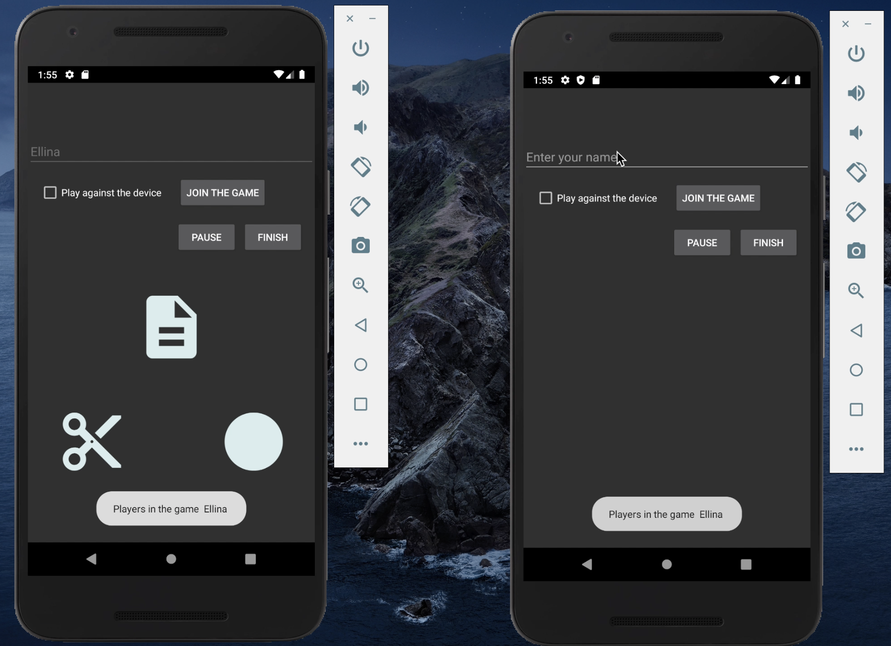
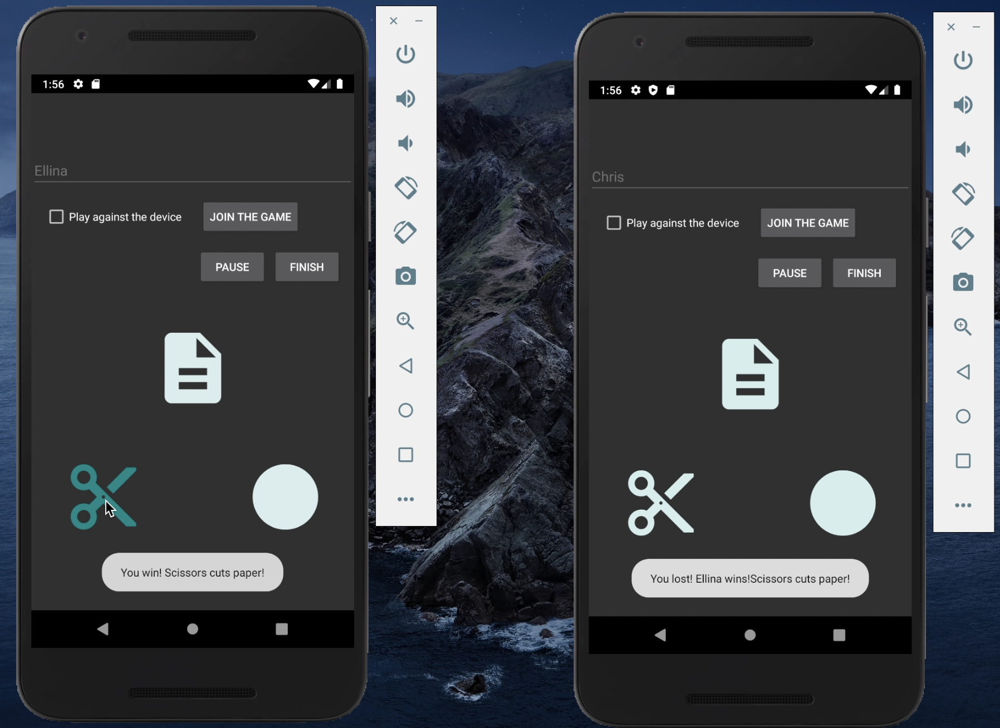
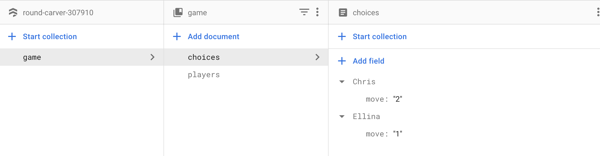

**Rock Papes Scissors**  
The application is a solution for Rock Paper Scissors game developed in Android Studio.  
The application is a multi-user game and in order to achieve Firebase with Firestore database is chosen.   

[Read more about firebase]( https://console.firebase.google.com/ )

After a firebase project is set up and integrated into the android project, you can run application in emulators and test its functionality.   

*Application layout*
* Two participants joined    

* Two participants played    

* Firestore    

 

